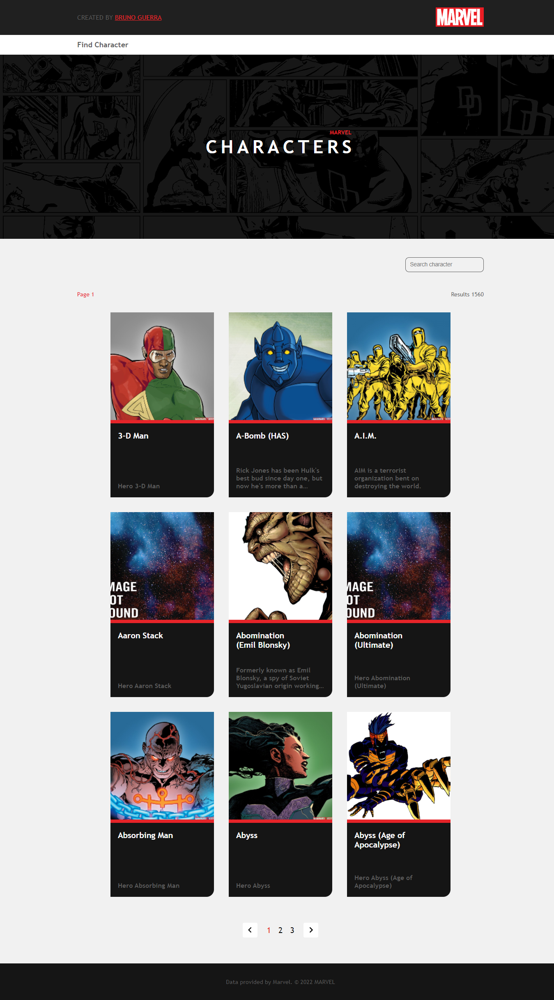

<h1 align="center">
    
    <br>
    Marvel App
</h1>

<h4 align="center">
  Find Character App with React and API Marvel
</h4>

<p align="center">
  <a href="#technologies">Technologies</a>&nbsp;&nbsp;&nbsp;|&nbsp;&nbsp;&nbsp;
  <a href="#information_source-how-to-use">How To Use</a>&nbsp;&nbsp;&nbsp;|&nbsp;&nbsp;&nbsp;
  <a href="">License</a>
</p>

<p align="center">
  
</p>

## Technologies

This project was developed for learning with the following technologies:

-   [API-Marvel](https://developer.marvel.com/)
-   [Typescript](https://www.typescriptlang.org/)
-   [ReactJS](https://reactjs.org/)
-   [Axios](https://github.com/axios/axios)
-   [styled-components](https://www.styled-components.com/)
-   [react-icons](https://react-icons.github.io/react-icons)
-   [VS Code][vc] and [ESLint][vceslint]

## How To Use

To clone and run this application, you'll need [Git](https://git-scm.com), [Node.js v16.14][nodejs] or higher + [Yarn v1.22][yarn] or higher installed on your computer. From your command line:

```bash
# Clone this repository
$ git clone https://github.com/brunorguerra/marvel-app

# Go into the repository
$ cd marvel-app

# Install dependencies
$ yarn install

# Run the app
$ yarn dev

# enter your browser and access
$ http://localhost:3000/
```

After installing the project and dependencies:

-   Go to the **Marvel API** website at (https://developer.marvel.com/)
-   Create your account and access your account dashboard
-   Copy your publicKey and privateKey
-   Go to `src>services>Api.ts`
-   Assign the values of your keys in the **publicKey** and **privateKey** variables

<!-- ## License

This project is under the MIT license. See the [LICENSE]() for more information. -->

---

Made with ♥ by Bruno Guerra [Get in touch!](https://www.linkedin.com/in/brunorguerra/)

[nodejs]: https://nodejs.org/
[yarn]: https://yarnpkg.com/
[vc]: https://code.visualstudio.com/
[vceslint]: https://marketplace.visualstudio.com/items?itemName=dbaeumer.vscode-eslint
